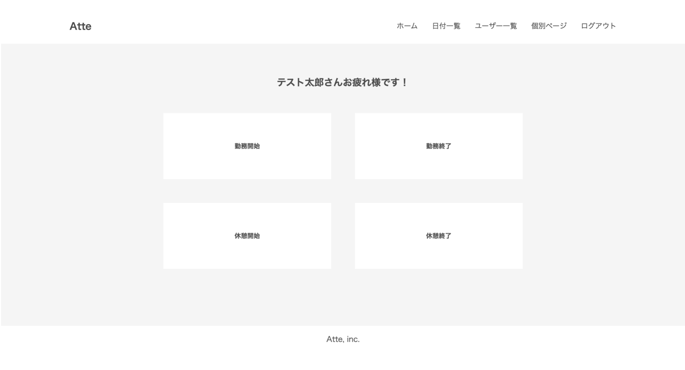
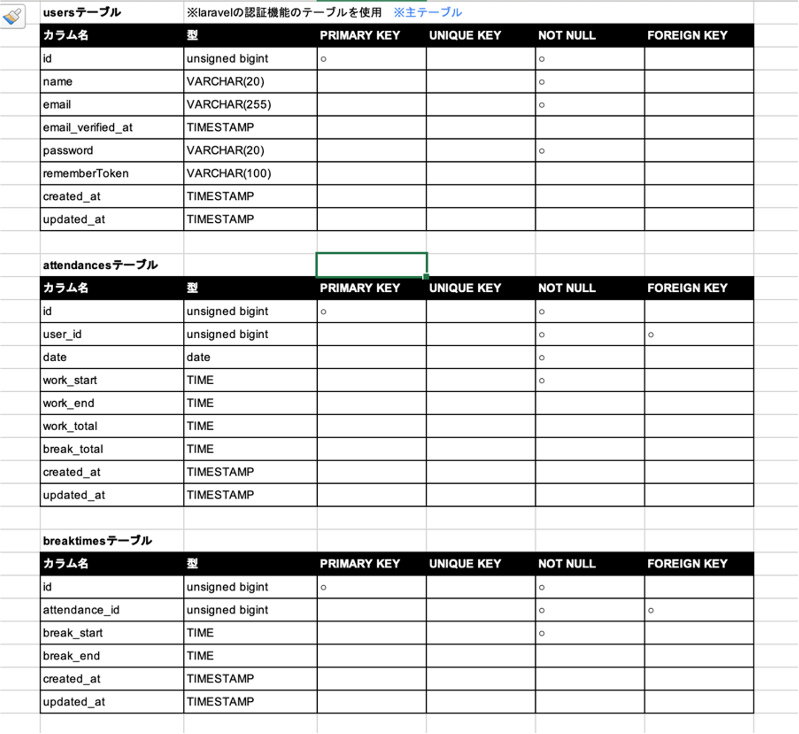
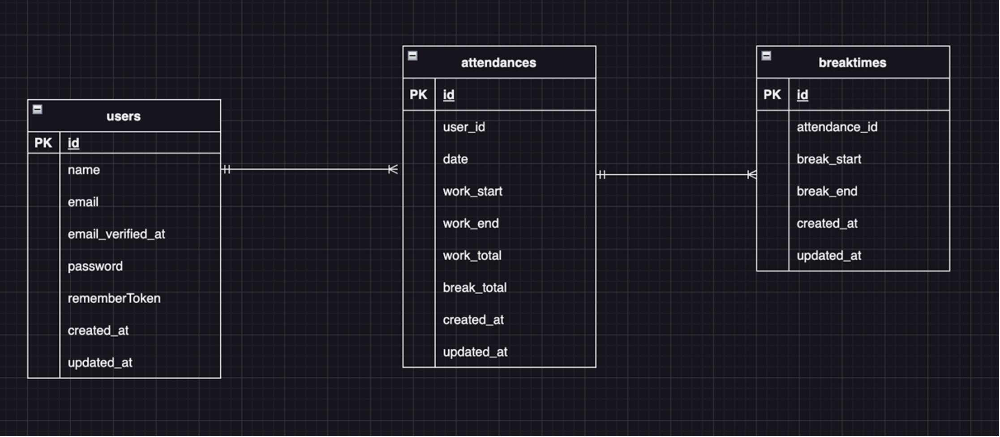

# アプリケーション名
**Atte**

## 概要説明（どんなアプリか）
ユーザーの勤務時間や休憩時間を管理する勤怠管理システム

## 作成した目的
ユーザーの勤怠を管理するため

## 機能一覧
- 会員登録機能
- メール認証機能
- ログイン機能
- ログアウト機能
- 勤怠登録機能

## 使用技術（実行環境）
- laravel8
- php7.4.9
- Breeze
- [MailHog](http://localhost:8025/)

## テーブル設計

## ER図

## 環境構築
ダミーデータを9件登録しております。下記手順にてご確認願います。

1. 開発環境を以下よりクローン
git@github.com:YukikoTK/Takeichi_attendance_system.git

2. Docker の設定(開発環境構築)

       $ docker-compose up -d --build

3. Laravelのパッケージをインストール

 - PHPコンテナにログイン

        $ docker-compose exec php bash

 - パッケージのインストール

       $ composer install

4. .env ファイルの作成

       $ cp src/.env.example .env

    作成された.envファイルはsrcディレクトリに保存する

5. 以下の通り.envファイルを修正

       DB_CONNECTION=mysql

       DB_HOST=mysql

       DB_PORT=3306

       DB_DATABASE=laravel_db

       DB_USERNAME=laravel_user

       DB_PASSWORD=laravel_pass

6. アプリケーションを起動する為のキーを作成

        php artisan key:generate

7. モデルのマイグレーション、テストデータ挿入

       php artisan migrate:fresh --seed

8. MailHog（認証メールを送信）を使用するために、.envファイルを下記の通り修正

       MAIL_MAILER=smtp

       MAIL_HOST=mailhog

       MAIL_PORT=1025

       MAIL_USERNAME=null

       MAIL_PASSWORD=null

       MAIL_ENCRYPTION=null

       MAIL_FROM_ADDRESS=null

       MAIL_FROM_ADDRESS=test@test.com

9. localhost/loginにアクセスし、下記のデータを使用してログイン

- メールアドレス : taro@test.com
- パスワード : password
